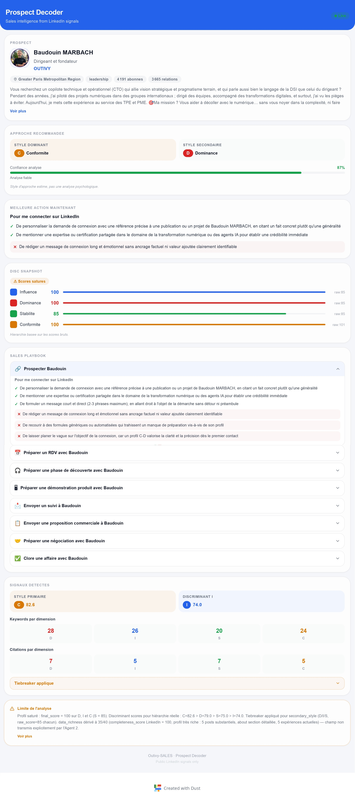

# Outivy Dust — HumanLinker Pipeline (LK Series)

Public export of **Dust.tt** agent configurations that compose the **HumanLinker (LK Series)** pipeline from the Outivy workspace.

> **Purpose:** Enrich a LinkedIn profile, analyze its DISC behavioral style, generate personalized sales recommendations, and produce a React TSX UI for a Chrome Extension.


*Output of the LK-5-FrameExtension agent: the ProspectDecoder React TSX component rendered as a Chrome Extension panel.*

---

## Pipeline Architecture

```
LK-1 (LinkedIn Enricher)
  │  Scrape profile + posts via Apify → raw JSON
  ▼
LK-2 (Keyword DISC Analyzer)
  │  Extract DISC linguistic markers from the profile
  ▼
LK-3 (DISC Score Calculator)
  │  Compute quantified DISC scores (0-100) + confidence
  ▼
LK-4 (Argumentation Generator)
  │  Produce a personalized 8-step sales sequence
  ▼
LK-5 (Frame Extension - UI)
     Generate a React TSX component for Chrome Extension
```

Each agent is called via **handoff** (agent as tool) — the previous one passes its result to the next through `run_agentX`.

---

## Agents

| # | Name | Role | Model | Data Sources |
|---|---|---|---|---|
| LK-1 | [LinkedInEnricher](agents/LK-1-LinkedInEnricher.yaml) | LinkedIn profile extraction via Apify | claude-sonnet-4-6 (0°C) | — |
| LK-2 | [Keyword_DISC_Analyzer](agents/LK-2-Analyseur_keyword_DISC.yaml) | DISC linguistic analysis | claude-sonnet-4-6 (0.7°C) | DISC Behavioral Database (Google Drive) |
| LK-3 | [DISC_Score_Calculator](agents/LK-3-Calculateur_Scores_DISC.yaml) | Psychometric DISC scoring | claude-sonnet-4-6 (0.7°C) | DISC Behavioral Database (Google Drive) |
| LK-4 | [Argumentation_Generator](agents/LK-4-Argumentaire.yaml) | DISC-based sales sequence | claude-sonnet-4-6 (0.7°C) | Outivy Service Offer + DISC Database (Google Drive) |
| LK-5 | [FrameExtension](agents/LK-5-FrameExtension.yaml) | React TSX Chrome Extension UI | claude-sonnet-4-6 (0.7°C, light reasoning) | — |

---

## Technical Configuration

- **Dust Workspace:** outivy
- **Model:** `anthropic/claude-sonnet-4-6` (all agents)
- **Shared Data Space:** `Company Data` (`vlt_bnZYnlPDhMxP`)
- **Tag:** `Outivy-SALES` (protected, on LK-1 and LK-4)
- **Orchestration:** Sequential handoff via `run_agent` MCP tool
- **Apify Actors used by LK-1:**
  - [Profile Details Scraper for LinkedIn + EMAIL (No Cookies)](https://apify.com/apimaestro/linkedin-profile-detail)
  - [Profile Posts Scraper for LinkedIn [No Cookies]](https://apify.com/apimaestro/linkedin-profile-posts)

### Generation Parameters

| Agent | Temperature | Reasoning Effort |
|---|---|---|
| LK-1 | 0 | medium |
| LK-2 | 0.7 | medium |
| LK-3 | 0.7 | medium |
| LK-4 | 0.7 | medium |
| LK-5 | 0.7 | light |

---

## Data Flow

1. **LK-1** receives a LinkedIn URL, calls two Apify actors (profile + posts), aggregates the JSON and passes it to LK-2
2. **LK-2** analyzes the profile to extract DISC markers per dimension (D, I, S, C) and passes the structured JSON to LK-3
3. **LK-3** computes DISC scores (raw + final), applies scoring rules (temporality, tiebreaker, cap at 100, confidence) and passes to LK-4
4. **LK-4** generates an 8-step sales sequence (prospecting → closing) adapted to the DISC profile and sales context, then passes to LK-5
5. **LK-5** produces a complete React TSX component (ProspectDecoder) for display inside a Chrome Extension

---

## Knowledge Base Documents

The `data_sources/` folder contains the reference documents used by the agents:

| File | Used By | Description |
|---|---|---|
| [DISC database keywords](data_sources/DISC%20database%20keywords) | LK-2, LK-3, LK-4 | DISC keyword dictionary, behavioral markers, and scoring methodology reference |

These documents were originally hosted on Google Drive and connected to Dust as data sources. They have been extracted and committed to this repository for portability.

---

## Repository Structure

```
outivy-dust-HumanLinker_like/
├── README.md
├── LICENSE (MIT)
├── assets/
│   └── screenshots/
│       └── prospect-decoder-ui.jpg    # LK-5 output render
├── agents/
│   ├── LK-1-LinkedInEnricher.yaml
│   ├── LK-2-Analyseur_keyword_DISC.yaml
│   ├── LK-3-Calculateur_Scores_DISC.yaml
│   ├── LK-4-Argumentaire.yaml
│   └── LK-5-FrameExtension.yaml
└── data_sources/
    └── DISC database keywords           # Knowledge base document
```

---

## Notes

- Original prompts were in French. They have been translated to English in the YAML files of this repo. The original Dust agents remain in French.
- LK-5 produces React TSX code intended for integration into a **Chrome Extension** for displaying prospect data inside LinkedIn.
- The DISC data source document has been included in `data_sources/` for reference. Additional Google Drive documents (Outivy Service Offer) may need to be exported separately.

---

## License

MIT — see [LICENSE](LICENSE) file.
